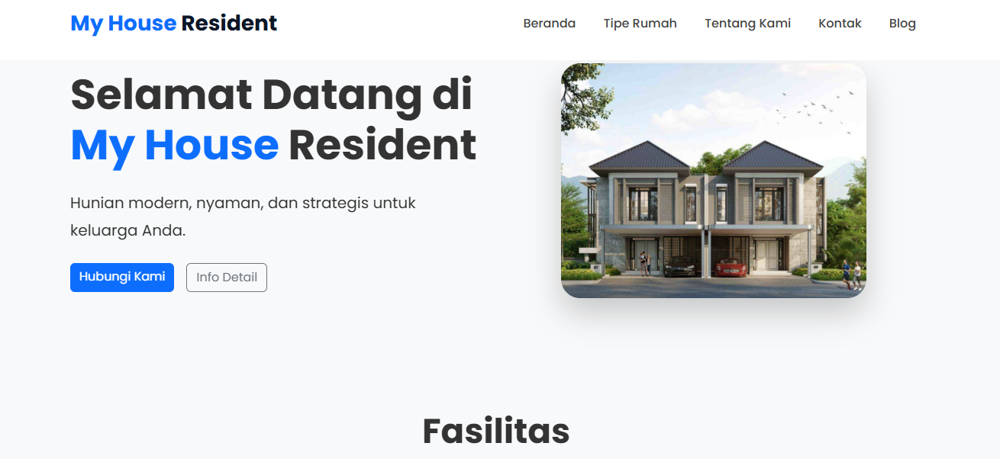
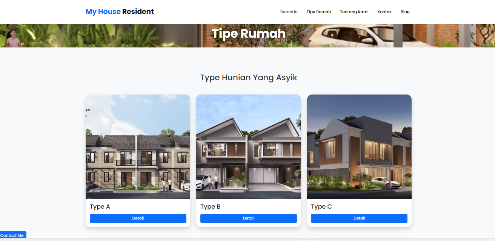
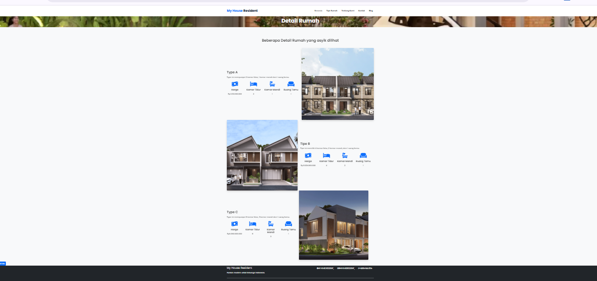
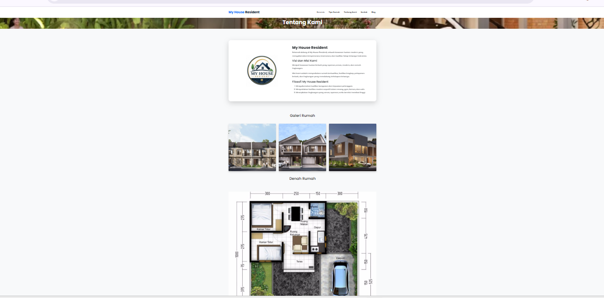
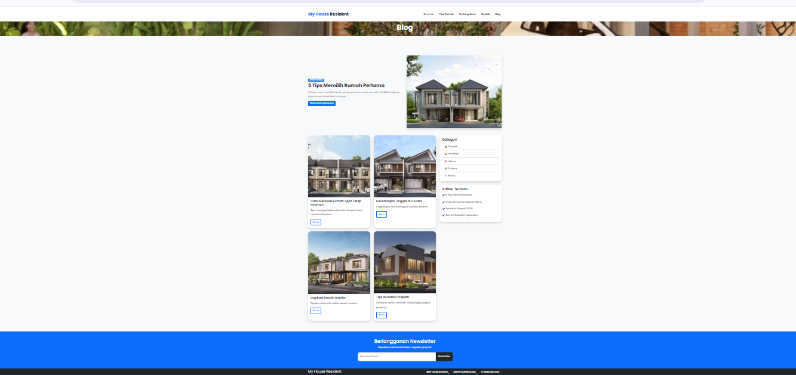

# 🌐 Live Demo

🔗 https://edwinalfadin.github.io/Build-a-Property-Web/

# 🏡 My House Resident

Website properti modern yang menampilkan informasi hunian, tipe rumah, fasilitas, blog, dan halaman kontak dengan desain yang responsif.

---

## ✨ Fitur

- 🏠 Beranda modern
- 🏡 Halaman Tipe Rumah
- 📄 Detail Rumah
- 👨‍👩‍👧 Tentang Kami
- 📞 Form Kontak
- 📰 Blog Properti
- 🏊 Fasilitas:
  - Kolam Renang
  - Fitness Center (Gym)
  - Cafe
- 📱 Responsive Design
- 🎨 Animasi AOS
- ⭐ Icon Font Awesome

---

## 🛠️ Teknologi

- HTML5
- CSS3
- Bootstrap 5
- JavaScript
- AOS Animation
- Font Awesome

---

## 📂 Struktur Project

myhouse-resident-property/
│
├── index.html
├── tipe.html
├── detail_rumah.html
├── tentang.html
├── kontak.html
├── blog.html
│
├── css/
│   └── style.css
│
├── js/
│   └── script.js
│
├── img/
│   ├── rumah1.jpg
│   ├── rumah2.jpg
│   ├── rumah3.jpg
│   ├── blog1.jpg
│   ├── content-title.png
│   └── ...
│
└── README.md

---

## 📸 Tampilan Website

### Beranda

### Tipe Rumah

### Detail Rumah

### Tentang Kami

### Blog

---

## 🚀 Cara Menjalankan

1. Download atau Clone repository

bash
git clone https://github.com/EdwinAlfadin/Build-a-Property-Web.git

2. Masuk ke folder project

bash
cd myhouse-resident-property

3. Jalankan menggunakan Live Server pada Visual Studio Code.

---

## 📌 Fasilitas Hunian

- 🏊 Infinity Swimming Pool
- 💪 Fitness Center
- ☕ Cafe & Lounge
- 🚗 Carport
- 🌳 Taman Hijau
- 🔐 Keamanan 24 Jam

---

## 👨‍💻 Author

*Ahmad Edwin Alfadin*

Frontend Developer

GitHub:
https://github.com/EdwinAlfadin

LinkedIn:
https://linkedin.com/in/ahmad-edwin-alfadin-alfa

---

## 📄 License

Project ini dibuat untuk tujuan pembelajaran dan pengembangan portfolio.

© 2026 Ahmad Edwin Alfadin
